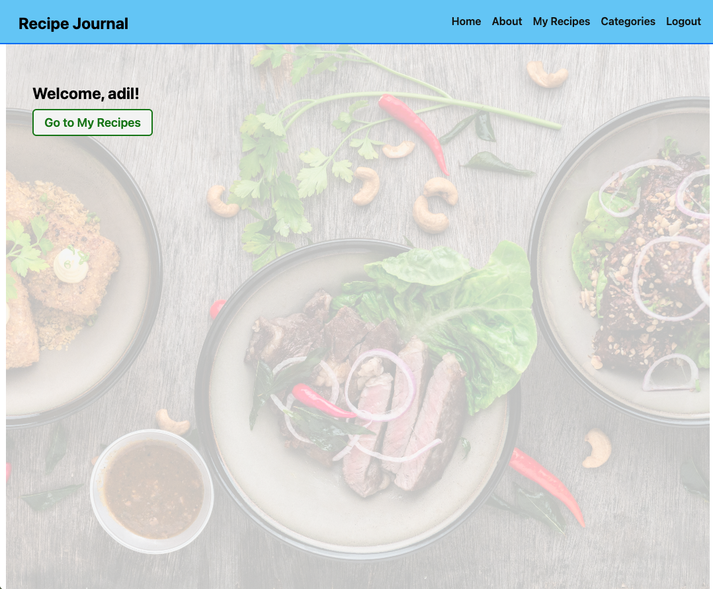

# 🍳 Recipe Journal

---

# Live App

https://recipejournal-a7f08a286396.herokuapp.com/

---

# Description

* This project is a Django CRUD web application built with Python and Django.
* The app allows users to create and manage their personal recipes.
* Each user has a private space to organize meals and categories.
* The project focuses on full CRUD functionality, authentication, authorization, and clean server-side rendering.

---

# Planning

* Project planning included MVP User Stories, wireframes, and database design.

Trello Board: https://trello.com/b/qYJ8QNEN/recipe-journal

---

# How-To-Use

* Users can sign up by creating a new account.
* Registered users can log in securely.
* After logging in, users land on the Home page.
* Users can view a list of their recipes.
* Users can create a new recipe using a form.
* Recipes can be opened in a detailed page.
* Users can edit or delete only their own recipes.
* Users can organize recipes using personal categories.

---

# Screenshot

# Features

* Django built-in authentication (Sign up / Log in / Log out)
* Login required to access app content
* Full CRUD operations for recipes
* Full CRUD operations for categories
* User-based data filtering (users see only their data)
* Class-Based Generic Views
* Clean template structure
* Responsive and simple UI

---

# Technologies Used

* Python
* Django
* SQLite
* HTML
* CSS

---

## Attributions
* Project built using General Assembly course materials.

---

# Next Steps

* Add image upload for recipes
* Add search and filtering
* Add pagination
* Public recipe sharing
* REST API version (Django REST Framework)
